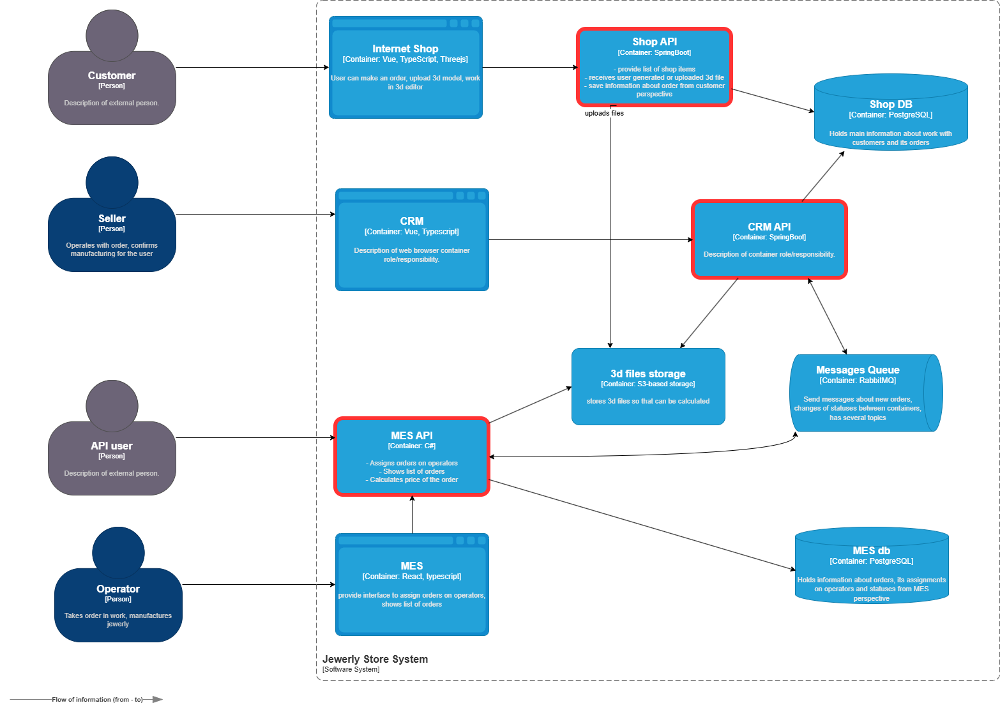
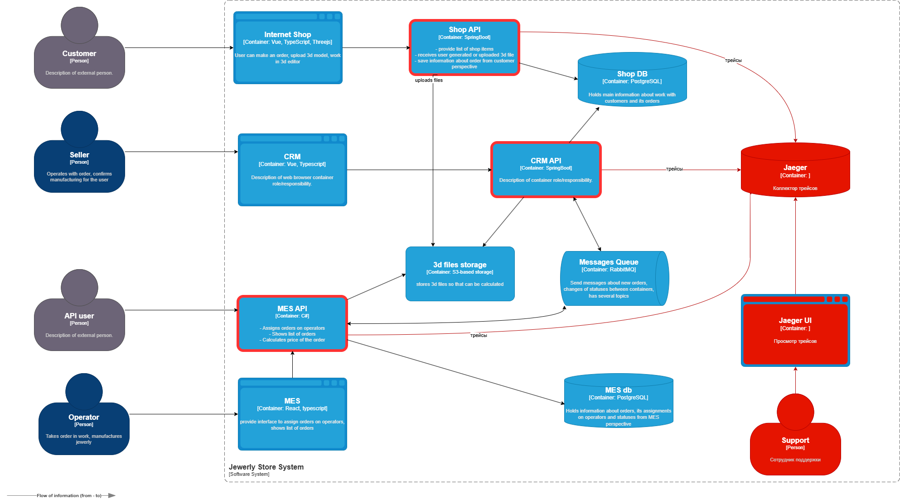
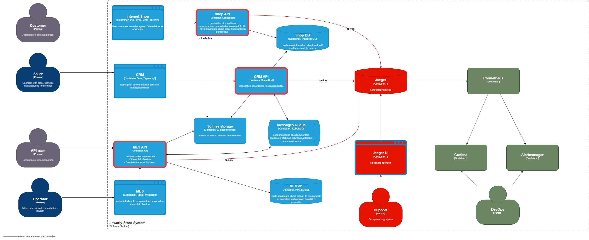

# Архитектурное решение по трейсингу

# Анализ

Системы, в которых происходит изменение статусов заказа:

- Shop API — INITIATED, FILE_UPLOADED, SUBMITTED;
- CRM API — MANUFACTURING_APPROVED, CLOSED;
- MES API — PRICE_CALCULATED, MANUFACTURING_STARTED, MANUFACTURING_COMPLETED, PACKAGING, SHIPPED

Передача заказа из Shop API в CRM API происходит, видимо, посредством связи через общую БД. Передача между CRM API и MES
API происходит посредством Message Queue. Наибольшая вероятность "зависания" заказа, судя по симптоматике, как раз при
приеме из Message Queue в CRM API.

Трейсингом, следовательно, желательно охватить все три сервиса, однако если это не удастся сделать быстро, то сначала
следует сосредоточиться на сервисах CRM API и MES API, поскольку именно их взаимодействие явно нарушено.

[Сервисы для трассировки](diagrams/jewerly_tracing_services.drawio)

# Данные

Для отслеживания заказа на этапах его жизненного цикла предлагается собирать следующие данные:

- **Trace ID** — уникальный идентификатор трейса, позволяющий объединить события, связанные с одним заказом.
- **Идентификатор заказа** — уникальный идентификатор заказа;
- **Текущий статус заказа** — (`INITIATED`, `MANUFACTURING_APPROVED`, `SHIPPED` и т.д.);
- **Дата/время изменения статуса** — время перехода в текущий статус;
- **Источник события** — название сервиса, выполнившего изменение статуса.
- **Контекст операции** — дополнительная информация: идентификатор пользователя, IP-адрес, данные о входящем запросе или
  сообщении из очереди.
- **Span ID** — идентификатор шага внутри трейса (например, выполнение одной операции в конкретном сервисе).
- **Parent Span ID** — идентификатор предыдущего шага внутри трейса, обеспечивая построение списка/дерева трейса.
- **Код результата операции** — успешное выполнение или ошибка (например, HTTP-статус, код исключения).
- **Описание ошибки (если есть)** — текстовое описание сбоя, стектрейс, уровень логирования.

# Мотивация

Трассировка повышает т.н. "наблюдаемость" системы, т.е. способность зафиксировать ее поведение и в дальнейшем
проанализировать его, включая анализ ошибочно завершившихся бизнес-процессов. Без сквозной трассировки невозможно точно
определить, на каком этапе происходит сбой или задержка, особенно потому, что в нашей системе заказ передаётся между
независимыми сервисами через асинхронные каналы (например, Message Queue).

Это приводит к увеличению времени на диагностику
инцидентов, снижению качества поддержки клиентов и потере доверия к системе.

В частности, трассировка позволит:

1. **Сократить время выявления и устранения сбоев (MTTR)**  
   Благодаря единому трейсу по всем сервисам можно будет быстро находить "зависшие" заказы, анализировать, в каком
   сервисе последний раз обновлялся статус, и выявлять проблемы в интеграции сервисов.
2. **Улучшить качество клиентской поддержки**  
   Поддержка сможет по идентификатору заказа отслеживать его полный путь через систему, и предоставлять клиенту точную
   информацию о текущем статусе и причинах задержек.
3. **Выявить узкие места в бизнес-процессе**  
   Анализ временных меток между статусами (например, от `MANUFACTURING_STARTED` до `MANUFACTURING_COMPLETED`) поможет
   оптимизировать производственные циклы и предсказывать сроки выполнения заказов.
4. **Внедрить автоматический мониторинг и оповещение о проблемах в бизнес-процессе**  
   На основе данных трассировки можно строить дашборды с метриками и оповещениями о проблемах, например:
    - Среднее время прохождения заказа по статусам;
    - Количество заказов, "застрявших" в промежуточном статусе более N часов;
    - Частота ошибок при обработке заказов.

Это позволит оперативно реагировать на аномалии до того, как они повлияют на клиентов или, как минимум, снизить
негативное впечатление, которое производят на клиентов сбои.

# Предлагаемое решение

Опишите, как и с помощью каких технологий будет реализован трейсинг, какие
компоненты нужно внедрить или доработать. Отразите компоненты и новые связи на схеме. Скачайте диаграмму контейнеров
«Александрита» в модели C4. Доработайте диаграмму, исходя из вашего решения: отразите на ней новые компоненты и связи.
Новые элементы выделяйте красным цветом — так ревьюеру будет проще проверить вашу работу. Когда схема будет готова,
добавьте ссылку на неё в раздел «Предлагаемое решение».

## Общая архитектура трейсинга

Для трассировки заказа на этапах жизненного цикла предлагается использовать централизованную систему на базе
продуктов *OpenTelemetry* и *Jaeger*, дополненную компонентами для мониторинга и алертинга. Такое решение позволит
отслеживать путь заказа от момента создания до отгрузки, отслеживая события в различных сервисах по идентификаторам
трассировки и заказа.

### Доработки и новые компоненты:

**Доработки**:

- *OpenTelemetry* — библиотеки OTel должны быть внедрены в сервисы Shop API, CRM API и MES API;
- *Message Queue* — существующая очередь модернизируется для передачи `Trace ID` и `Span ID` в заголовках сообщений;

Сервисы должны быть доработаны, с тем чтобы позволить:

- генерацию и передачу контекста трейса:
    - при получении HTTP-запроса или сообщения из очереди сервис должен извлекать из них контекст;
    - при внутренней обработке должен формироваться новый `span`, описывающий операцию;
    - при вызове другого сервиса или отправке в очередь должен передаваться и контекст;
- передачу спанов в *Jaeger*:
    - спан содержит: `order_id`, `status`, `source_service`, `timestamp`, `result_code`, `error_message` (если есть).

**Новые компоненты**:

- *Jaeger* — сервер для приёма, хранения и визуализации трейсов;
- *Jaeger UI* — приложение для поиска и просмотра трейсов;
- *Prometheus* и *Grafana* — сервисы агрегации метрик из трейсов и построения дашбордов;
- *Alertmanager* — сервис оповещений по аномальным событиям или ошибкам.

### Реализация мониторинга и оповещений

Для автоматического контроля за жизненным циклом заказа предлагается реализовать следующее:

1. Извлечение метрик из трейсов:
    - сервер Prometheus получает метрики из Jaeger через **Jaeger Exporter**;
    - Ключевые метрики:
        - длительность нахождения заказа в каждом статусе;
        - количество заказов в промежуточных статусах;
        - счётчик ошибок;
2. Визуализация в Grafana:
    - Дашборд "Жизненный цикл заказа":
        - Графики времени обработки по статусам;
        - Таблица "зависших" заказов (более N часов в `MANUFACTURING_APPROVED` или `SHIPPED`);
        - Число ошибок по сервисам;
3. Алертинг в Alertmanager:
    - Правила:
        - `OrderStuckInStatus`: если заказ > N часов в статусе `MANUFACTURING_APPROVED` или `SHIPPED`;
        - `CRMProcessingFailed`: если более T ошибок обработки сообщений из очереди за 5 минут;
        - `TraceLossDetected`: если в течение часа не зафиксировано ни одного спана от MES API.

### Схема взаимодействия

[Диаграмма с трейсингом (новые компоненты — красным)](diagrams/jewelry_tracing_solution.drawio)

[Диаграмма с мониторингом и алертингом (дополнительные компоненты — зелёным)](diagrams/jewelry_tracing_monitoring.drawio)

# Компромиссы

- Внедрение OpenTelemetry и сбор телеметрии добавляет накладные расходы, это может повлиять на скорость обработки
  запросов;
- Хранение трейсов в Jaeger требует дополнительных ресурсов, и при линейном росте нагрузки хранение всех трейсов на
  длительный срок может быть дорогостоящим; желательно ввести политики хранения: например, хранить полные трейсы в
  течение недели после завершения заказа.

# Аспекты безопасности

Внедрение системы трейсинга влечёт за собой сбор, передачу и хранение чувствительной информации: контекст операций,
сообщения об ошибках. В случае утечки этих данных может быть частично раскрыта внутренняя структура приложения. Ситуация
осложняется использованием облачных развертываний.

- Доступ к Jaeger UI и Grafana должны иметь только сотрудники компании и только с соответствующими ролями:
    - `Support` — может просматривать трейсы по `order_id`, но не видит детали ошибок;
    - `DevOps` — полный доступ к трейсам, метрикам, настройкам алертов;
    - `Developer` — доступ к своим сервисам, ограниченный по времени (через временную выдачу доступа);
- Все данные, передаваемые между сервисами и сборщиками трейсов должны шифроваться с помощью TLS; в частности, экспорт
  из сервисов в *Jaeger* должен использовать`HTTPs`;
- *Jaeger* должен:
    - Шифровать данные на уровне хранилища (at-rest encryption);
    - Ограничить доступ к базе только сервисному аккаунту (ТУЗ);
    - Регулярно аудитироваться на предмет несанкционированных подключений;
- Трейсы не должны содержать персональные данные и должны регулярно мониториться на соблюдение этого требования (
  автоматически, с оповещением в случае выявления нарушения).
