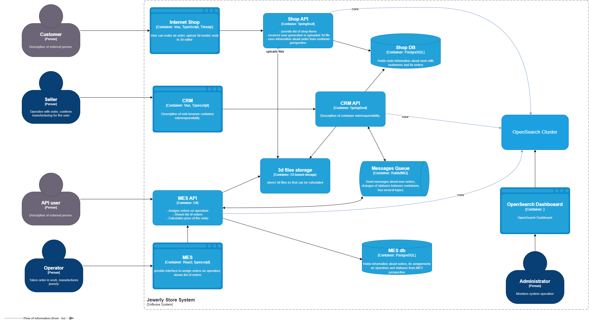

# Архитектурное решение по логированию

## Анализ

Логированием необходимо в первую очередь покрыть бизнес-процесс обслуживания заказа на всем протяжении его жизненного
цикла. Поскольку отдельные этапы цикла происходят в различных сервисах, все они должны быть охвачены логированием.

- **Shop API** обслуживает переходы в статусы:
    - INITIATED — пользователь завёл новый заказ или положил товары в пустую корзину.
    - FILE_UPLOADED — пользователь загрузил файл с 3D-моделью или создал его с помощью конструктора.
    - SUBMITTED — пользователь нажал на кнопку «Сделать заказ».
- **MES API** обслуживает переходы в статусы:
    - PRICE_CALCULATED — система посчитала стоимость заказа.
    - MANUFACTURING_STARTED — оператор взял заказ в работу.
    - MANUFACTURING_COMPLETED — оператор выполнил заказ.
    - PACKAGING — оператор начал упаковывать заказ.
    - SHIPPED — заказ отправлен покупателю.
- **CRM API** обслуживает переходы в статусы:
    - MANUFACTURING_APPROVED — заказ подтверждён, его можно отдавать в производство.
    - CLOSED — заказ завершён. Он закрывается после получения сообщения от транспортной компании или вручную.

### События уровня INFO

- Смена статуса заказа: дата/время, ID заказа, прежний статус, новый статус, ID клиента, ID исполняющего сотрудника
- Загрузка или создание файла 3d-модели: дата/время, ID заказа, ID клиента, ID файла, размер файла
- Завершение расчета цены: дата/время, ID заказа, ID клиента, затраченное время
- Завершение изготовления заказа: дата/время, ID заказа, затраченное время
- Отправка заказа: дата/время, ID заказа, затраченное время от момента завершения изготовления
- Завершение заказа: дата/время, ID заказа, затраченное время от момента подачи заказа клиентом

*Примечание:* Записи с мерами времени отдельных этапов заказа введены из-за распределенного характера хранения сведений
о заказе в различных БД. Они могут использоваться как источник данных для статистики.

### События уровня WARN

- Сбой связи с очередью сообщений: дата/время, ID заказа, причина сбоя
- Сбой связи с файловым хранилищем: дата/время, ID заказа, причина сбоя

Обе упомянутые системы напрямую задействованы в бизнес-процессе, их отказ может повлиять на сроки исполнения заказов или
быть причиной ошибок в функционировании системы.

### События уровня ERROR

- Файл на найден в файловом хранилище: дата/время, ID заказа, ID файла

Утрата файла, загруженного пользователем - серьезная проблема, не только влекущая недовольство пользователя и
потенциальную потерю клиента, но и свидетельствующая о ненадежности инфраструктуры компании или атаке.

### События младших уровней логирования

Могут вводиться разработчиками сообразно потребностям разработки и отладки. На промышленной среде игнорируются.

## Мотивация

Логирование повышает т.н. "наблюдаемость" системы, т.е. способность зафиксировать ее поведение и в дальнейшем
проанализировать его, включая анализ действий сотрудников в ходе исполнения бизнес-процесса.

В частности, логирование позволит ввести:

- измерение времени, затраченного на исполнение этапов бизнес-процесса;
- выявление и измерение задержек и сбоев в бизнес-процессе;
- выявление и оценку частоты технических сбоев вычислительной инфраструктуры компании;
- выявление и расследование случаев злонамеренного поведения пользователей.

В настоящий момент невозможно ввести логирование во всех системах сразу, поэтому порядок внедрения логирования должен
быть таким:

1. Система CRM API -- с наибольшей вероятностью является причиной сбоев в бизнес-процессе и недовольства клиентов;
   анализ ее поведения наиболее насущен для разрешения текущих проблем компании с заказами;
2. Система MES API -- с некоторой вероятностью является причиной сбоев в бизнес-процессе и недовольства клиентов;
   испытывает перегрузку, несмотря на резерв производства к дальнейшему расширению; может оказаться сдерживающим
   фактором при дальнейшем росте;
3. Система Shop API -- в настоящий момент не вызывает проблем, однако задействована в бизнес-процессе, и должна
   логироваться для полного отслеживания жизненного цикла заказа; кроме того, может стать узким местом при дальнейшем
   росте числа заказов.

## Предлагаемое решение

### Технологии и архитектура логирования

Для реализации централизованного логирования предлагается использовать **стек OpenSearch с OpenSearch Dashboards**, а
также **Filebeat** в качестве агента сбора логов. Ниже приведены обоснования и описание компонентов.

#### Выбор технологии: OpenSearch

OpenSearch — это форк Elasticsearch, созданный Amazon, распространяемый под лицензией **Apache 2.0**. Он полностью
open-source, поддерживает Kibana-совместимые интерфейсы (в виде OpenSearch Dashboards), масштабируем и хорошо
интегрируется с экосистемой Beats и Logstash.

**Преимущества OpenSearch:**

- Открытая лицензия (в отличие от Elastic, где часть функций закрыта).
- Поддержка сложных аналитических запросов и агрегаций.
- Хорошая масштабируемость и отказоустойчивость.
- Поддержка безопасности (аутентификация, шифрование, ACL).
- Совместимость с Logstash, Filebeat, Fluentd.

#### Компоненты системы логирования

1. **Filebeat** (на каждом сервисе)  
   Легковесный агент, размещаемый на серверах/в контейнерах сервисов (Shop API, MES API, CRM API).
    - Собирает логи из файлов или *stdout* контейнеров.
    - Фильтрует и форматирует записи в структурированный JSON.
    - Передаёт логи в **OpenSearch Ingest Node** или через **OpenSearch Logstash** (если нужна сложная обработка).

2. **OpenSearch Cluster**  
   Распределённое хранилище логов.
    - Работает в виде кластера из 3+ узлов для отказоустойчивости.
    - Обеспечивает индексацию, поиск и хранение логов.
    - Поддерживает TLS-шифрование и RBAC.

3. **OpenSearch Dashboards**  
   Веб-интерфейс для визуализации, поиска и анализа логов.
    - Позволяет строить дашборды по времени обработки заказов, частоте ошибок и т.д.
    - Поддерживает алертинг (через OpenSearch Alerting Plugin).

4. **(Опционально) OpenSearch Logstash**  
   Используется при необходимости сложной трансформации данных (парсинг нестандартных форматов, enrichment).  
   В данном случае может не понадобиться, если логи генерируются в структурированном виде.

### Необходимые доработки

**В сервисах** (Shop API, MES API, CRM API) доработать:

1. Логировать события в **структурированном JSON-формате**.
2. Писать логи в файл или в stdout (желательно, единообразно во всех сервисах).
3. Включить Filebeat в состав Docker-образа или развертывания.

**Пример структуры лога (INFO, смена статуса):**
```json
{
  "timestamp": "2025-04-05T10:23:45Z",
  "level": "INFO",
  "event": "order_status_changed",
  "order_id": "ORD-12345",
  "previous_status": "SUBMITTED",
  "new_status": "PRICE_CALCULATED",
  "customer_id": "CUST-678",
  "employee_id": null,
  "service": "CRM API"
}
```

**Дополнительно развернуть** компоненты:
- OpenSearch Cluster
- OpenSearch Dashboard

### Диаграмма компонентов (C4)

[Диаграмма компонентов](diagrams/jewerly_c4_model.drawio)



### Политика безопасности

- **Шифрование**: TLS между Filebeat и OpenSearch.
- **Аутентификация**: Использование API-ключей или сертификатов для Filebeat.
- **Авторизация (RBAC)**:
    - Администраторы — полный доступ.
    - DevOps/SRE — доступ к просмотру и алертам.
    - Разработчики — доступ только к своим сервисам (через индексы).
- **Чувствительные данные**:
    - Никакие персональные данные (ФИО, email, адреса) **не должны** попадать в логи.
    - Если необходимо — использовать хеширование (например, `customer_id` — всегда хеш или ID из CRM, а не email).
    - Регулярный аудит логов на наличие персональных данных.

### Политика хранения

- **Индексы**: Отдельный индекс для каждого сервиса.
- **Срок хранения**: 180 дней (в отсутствие других соображений -- многократно превышает нормальные сроки исполнения
  заказа, позволит отслеживать достаточно давно зависшие заказы).
- **Оценка объема**:
    - Средний заказ — 10-15 записей в лог.
    - 1000 заказов/день → 15 000 записей/день.
    - ~1 Кб на запись → ~15 Мб/день.
    - Учтем развертывания тестовой среды и среды разработки → ~45 Мб/день
    - Запас на непредвиденные нужды 30% → ~60 Мб/день
    - ИТОГО: ~60 Мб/день → ~11 Гб за 180 дней.

## Необходимые мероприятия для превращения системы сбора логов в систему анализа логов

### 1. **Настройка тревожных сигналов (алертов)**

Предлагается уведомлять ответственное лицо (дежурного) в следующих случаях:

- **ERROR-логи**: По событию `файл не найден в файловом хранилище` — немедленное уведомление (например, на email).
- **частые WARN-логи**: Если более 10 сбоев связи с очередью за 5 минут — подозрение на отказ RabbitMQ/Kafka.
- **аномалии нагрузки**: Используется OpenSearch Alerting с триггерами по агрегированным запросам.
    - Резкий рост числа `INITIATED` заказов (например, +1000% за минуту) — возможна DDoS-атака или бот-сетка.

### 2. **Анализ аномалий**

Анализ аномалий возможен с опцией **Anomaly Detection** OpenSearch.
Предлагается настроить обнаружение следующих событий:

- Необычно долгий расчет цены (сравнение с медианой или другим наперед заданным пороговым значением);
- Задержки между статусами (например, более 24 ч);
- Подозрительная активность одного `customer_id` (превышающая пороговое значение N заказов за минуту).

### 3. **Дашборды в OpenSearch Dashboards**

- Дашборд «Жизненный цикл заказа»: временные метки переходов между статусами.
- Дашборд «Ошибки в системе»: распределение ERROR/WARN по сервисам и типам.
- Дашборд «Производительность» — среднее время обработки заказа по дням.

## Дополнительное задание

| Критерий                   |                  ELK (Elastic)                   |                  OpenSearch                   |               Splunk               |         Graylog          |
|:---------------------------|:------------------------------------------------:|:---------------------------------------------:|:----------------------------------:|:------------------------:|
| **Лицензия**               |       Elastic License (частично закрытая)        |      Apache 2.0 (полностью open-source)       |       Проприетарная (дорого)       |  AGPLv3 / Проприетарная  |
| **Стоимость**              | Бесплатно до определённого объёма; платные опции | Бесплатно; коммерческие плагины — опционально |       Очень высокая (на GB)        | Бесплатно, платные опции |
| **Производительность**     |                     Высокая                      |                    Высокая                    |              Высокая               |         Высокая          |
| **Масштабируемость**       |                     Высокая                      |                    Высокая                    | Высокая, но требует больших затрат |         Высокая          |
| **Безопасность**           |       RBAC, шифрование (в платной версии)        |       Встроенное шифрование, TLS, RBAC        |   Отличная, но сложная настройка   |        TLS, RBAC         |
| **Простота использования** |                Требует настройки                 |               Простой интерфейс               |       Интуитивный интерфейс        |    Простой интерфейс     |
| **Сообщество и поддержка** |                  Очень большое                   |           Растущее (поддержка AWS)            |       Коммерческая поддержка       |   Активное сообщество    |

**Обоснование выбора OpenSearch:**

- open-source лицензия — нет риска блокировки функций.
- бесплатна при любом объёме — важно для масштабирования.
- Поддерживается AWS (Amazon Web Services) — высокая стабильность и документация.
- Подходит для задач централизованного логирования и анализа в распределённой системе.
- Проста в освоении — не потребует значительных затрат и задержек на обучение персонала 
