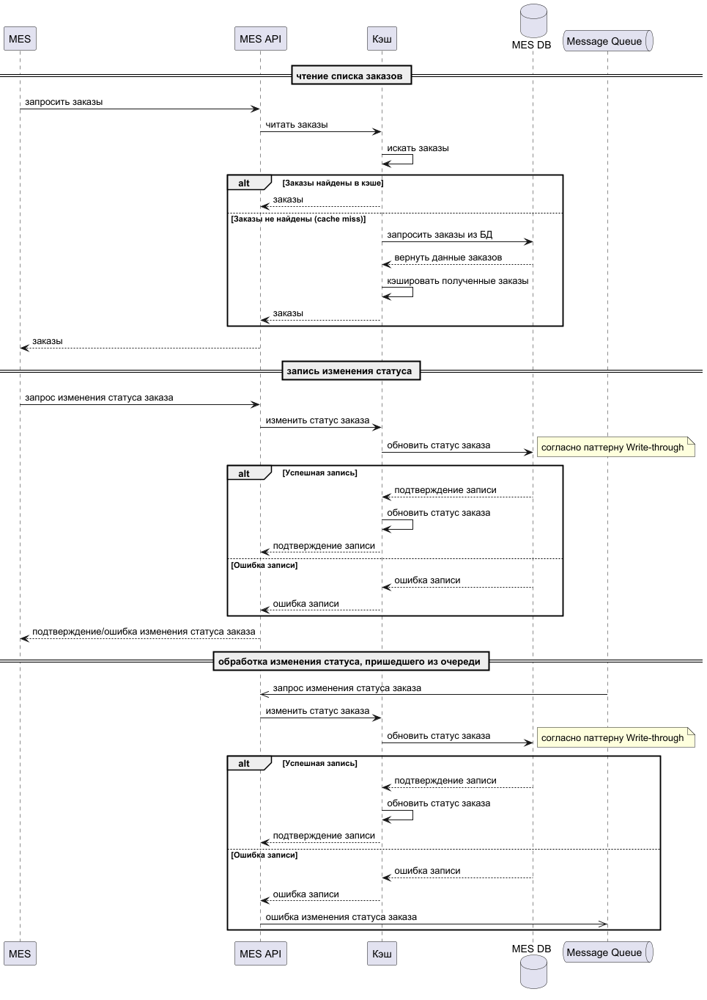

# Архитектурное решение по кешированию

## Анализ

По имеющимся данным, в настоящий момент длительная загрузка данных наблюдается только в MES.
Таким образом, именно эта система (MES API) подлежит внедрению кэширования в первую очередь.

## Мотивация

В настоящий момент ситуация в системе MES описывается так:

```markdown
Участились жалобы от операторов: когда они заходят на первую страницу MES, система долго прогружается. На первой
странице отображается список заказов в работе по статусам — это дашборд с фильтром. Раньше страница показывала все
заказы, но это тормозило загрузку. Команда сделала фильтр по статусам и пагинацию, но это не помогло. 
```

Таким образом, можно констатировать, что усилий команды разработки уже недостаточно, чтобы решить проблему долгой
загрузки страниц MES, а значит, и впустую потраченного рабочего времени. Эту проблему может решить кэширование.

Первопричина проблемы кроется в том, что множество заказов, поступающих извне, часто обновляют состояние базы данных, в
результате чего дашборд (включающий далеко не все поступившие данные) должен всякий раз полностью рассчитываться заново,
причем для всякого запроса. В результате, пять пользователей, приблизительно одновременно запросившие страницу, пять раз
запустят поиск данных в БД. Можно сэкономить значительное время если дашборд будет храниться в единственном экземпляре
на отдельном быстром хранилище, и обновляться одновременно с базой данных при изменении, а не при запросе пользователя.
В этом и состоит идея кэширования (в одном из вариантов).

Необходимо отметить, что линейно растущая нагрузка обещает в будущем создать подобные же проблемы в других частях
системы, однако на текущий момент о них ничего не известно. Внедряемые метрики должны будут показать, насколько велики
задержки в других системах, после чего можно будет принимать решения в их отношении. К этому моменту кэширование MES API
будет уже внедрено, и полученный опыт пригодится при внедрении кэширования в другие сервисы когда в этом возникнет
необходимость.

## Предлагаемое решение

Клиентское кэширование дашбордов могло бы дать хороший эффект в сервисе MES с точки зрения скорости отклика, однако в
описании указано:

```markdown
Операторам важно видеть самые новые заказы, потому что от этого зависит их вознаграждение, — кто взял заказ, тот и
получит оплату.
```

Клиентское кэширование неизбежно связано с задержкой обновления, к тому же на рабочих местах разных сотрудников кэш
будет обновляться неодновременно, что может провоцировать конфликты в коллективе (*«Иванов увел жирный заказ, потому что
несправедливая система ему заказ показала, а мне нет»*). По этой причине будет разумно отказаться от клиентского
кэширования в пользу серверного.

При реализации серверного кэширования можно применить паттерны *Write-Through* или *Write-Behind*.
В отличие от этих подходов, иные паттерны мало применимы к ситуации по следующим причинам:

- *Cache-Aside* -- хорошо подходит для систем с небольшим количеством операций записи, но MES к таковым не относится;
- *Read-Through* -- хорошо подходит для систем с небольшим количеством операций записи, но MES к таковым не относится;
- *Refresh-Ahead* -- мог бы подойти, но требует очень надежного кэша с отличным мониторингом, к чему инфраструктура
  компании пока не готова.

Выбор между паттернами *Write-Through* и *Write-Behind* следует делать с учетом следующих факторов:

| Критерий                                |           Write-Through            |              Write-Behind               |
|:----------------------------------------|:----------------------------------:|:---------------------------------------:|
| Простота реализации                     |              Высокая               |                 Средняя                 |
| Согласованность данных между кэшем и БД |             Немедленно             |        С задержкой (БД отстает)         |
| Скорость выполнения операции записи     | Низкая (запись сразу в кэш и в БД) | Высокая (запись в кэш, асинхронно в БД) |

В этих условиях предпочтительным на данном этапе представляется паттерн *Write-Through*. Он сравнительно легко
реализуется и сохраняет согласованность кэша с БД, что важно при первом опыте внедрении кэширования; при этом
недостатки -- снижение скорости записи -- в настоящий момент нельзя назвать существенными, на запись в БД нареканий не
поступало.

В перспективе можно рассмотреть и переход на паттерн Write-Behind, но это следует делать либо если в
компании уже есть экспертиза в этом паттерне, либо по накоплении опыта персоналом.

### Стратегия инвалидации кэша

Состояние базы данных может изменяться не только по запросам, проходящим через кэш в рамках паттерна Write-Through, но и
(отя бы потенциально) другими способами, поэтому необходимо правильно настроить порядок инвалидации (очистки) кэша.

Насколько можно судить, для кэша MES характерны следующие особенности:

- нельзя назвать характерное время актуальности данных, пользователь заинтересован в самых свежих;
- операции пользователей MES приводят к изменениям данных, отраженных в кэше;
- изменения данных, отраженных в кэше, могут происходить и независимо от пользователей MES (по запросам внешних
  пользователей);
- число запросов внешних пользователей велико и будет расти в дальнейшем;
- кэш содержит дашборды, т.е. изменения конкретных данных могут отражаться в запросах, не связанных индексом измененных
  данных.

В свете этих соображений применимость разных стратегий инвалидации можно просуммировать так:

| Страгия       | Вердикт     | Комментарий                                                                                                    |
|:--------------|:------------|:---------------------------------------------------------------------------------------------------------------|
| Временная     | не подходит | нет характерного времени актуальности                                                                          |
| На запросах   | не подходит | данные, измененные одним пользователем, влияют на содержимое кэша для других пользователей                     |
| На изменениях | подходит    | позволяет поддерживать актуальность данных, но грозит слишком частым обновлением кэша при возрастании нагрузки |
| Программная   | подходит    | позволяет гибко настроить актуальность данных, но требует значительных доработок сервиса MES API               |
| По ключу      | не подходит | нужна инвалидация объектов, не связанных индексом изменяемых данных                                            |

Можно рекомендовать начать со стратегии инвалидации, основанной на изменениях в данных, поскольку она обещает хороший
результат без значительных доработок основного функционала. В дальнейшем рекомендуется перейти к программной реализации
по мере возможности и накопления опыта разработчиками.

### Диаграмма последовательности действий

[Диаграмма последовательности](diagrams/sequence.plantuml)



Непосредственно в кэшировании задействованы только кэш, база данных MES DB и сервис MES API. На диаграммах добавлены
также приложение MES (клиент с точки зрения MES API) и очередь Message Queue.

Рассмотрены два основных сценария:

- запрос списка заказов в интересах оператора MES; он инициируется оператором и проходит через приложение MES;
- изменение статуса заказа рассмотрено в двух разновидностях:
    - по запросу оператора (проходит через приложение MES);
    - по сообщению, поступившему через очередь MessageQueue.

**При запросе списка заказов** последовательность действий такова (все операции исполняются синхронно):

- приложение MES вызывает сервис MES API, передавая запрос (вероятно, с параметрами фильтрации);
- сервис MES API обращается в кэш за данными;
    - если данные в наличии, кэш немедленно передает их сервису MES API;
    - если данных в кэше нет, кэш обращается в базу данных MES DB и вносит полученные данные в кэш, а затем передает их
      в MES API;
- сервис MES API передает данные приложению MES.

**При изменении статуса заказа по запросу оператора** последовательность действий такова (все операции исполняются
синхронно согласно паттерну *Write-Through*):

- приложение MES вызывает сервис MES API, передавая запрос с параметрами изменения статуса заказа (идентификатор заказа,
  новый статус, вероятно и дополнительные сведения);
- сервис MES API передает в кэш запрос на изменение данных;
- кэш передает запрос на изменение в базу данных MES DB;
- база данных MES DB исполняет запрос и возвращает либо подтверждение операции, либо ошибку;
    - если операция выполнена успешно, кэш обновляет данные измененного заказа и возвращает MES API сведения об успешном
      завершении (сигнал успеха либо собственно изменённые данные);
    - если операция неуспешна, кэш не обновляет сведений о заказе и возвращает в MES API ошибку исполнения;
- сервис MES API передает приложению MES сведения об успехе либо отказе операции.

**При изменении статуса заказа по сообщению из очереди Message Queu** последовательность действий в основном та же, со
следующими изменениями:

- на первом шаге сервис MES API получает сообщение из очереди Message Queue (а не запрос из MES);
- в силу асинхронного характера обмена через очередь сообщений MES API отвечает очереди немедленно и лишь техническим
  сигналом о приеме сообщения (ACK);
- на последнем шаге MES API:
    - не сигнализирует в очередь в случае успеха операции (поскольку произошло штатное завершение асинхронного
      взаимодействия с внешним сервером через очередь); это поведение может быть изменено в случае особых требований
      бизнес-логики;
    - в случае ошибки в очередь Message Queue передается сообщение об отказе операции (с целью уведомить отправителя о
      неуспехе для поддержания согласованности данных, например, паттерном Saga).

### Разрешение ситуации "гонки заказов"

Чтобы исключить ситуацию, когда один и тот же заказ “берут” одновременно различные операторы, логика действия системы
может быть следующей:

- и в кэше, и в базе данных вместе с записью о заказе хранится timestamp его последнего изменения в БД;
- при выполнении записи в БД кэш передает в составе запроса хранящийся в кэше timestamp, в общем стиле
  `UPDATE ... WHERE order_id = <ID> AND last_updated = <TIMESTAMP>`;
    - если в результате изменилась одна запись, БД в той же транзакции записывает новое значение `last_updated`,
      передает результат в кэш, и кэш обновляет сведения;
    - если не обновилось ни одной записи, значит другая операция уже обновила БД, и запись в настоящий момент
      невозможна, операция дает отказ.

Этот подход сравнительно прост в реализации, предотвращает гонку заказов, но может оказаться ненадежным при репликации
базы данных (в предположительном будущем).
